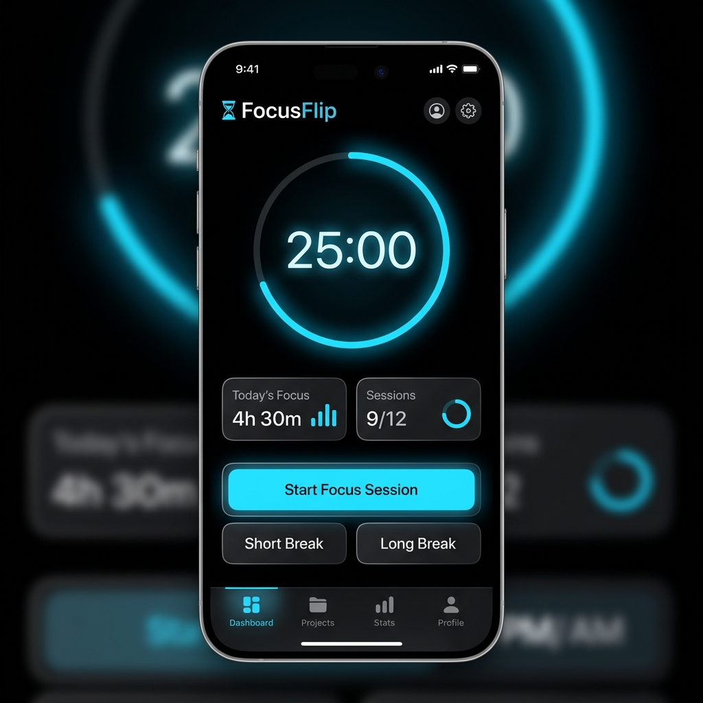
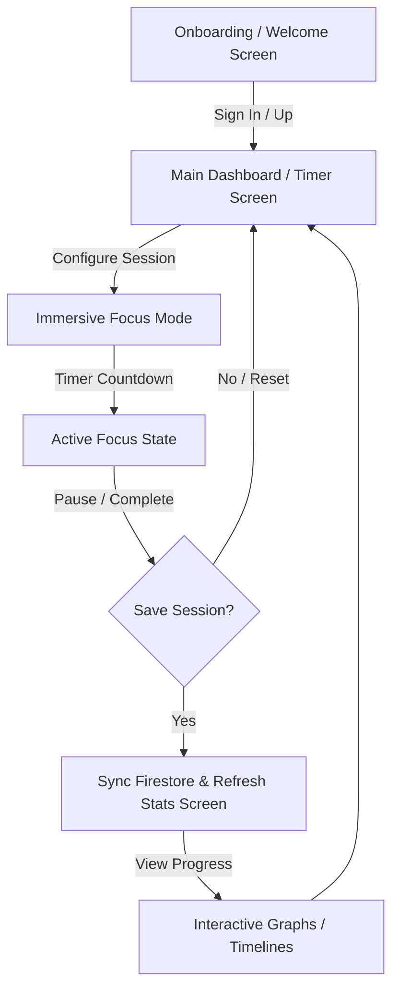

# 🌌 FocusFlip (TimeFlip)

🔗 **[Live Demo / Web App](https://timeflip-e3747.web.app/)**

> **Master your time, shape your focus.**  
> A premium, minimalist, and glassmorphic focus companion built with Flutter and Firebase, designed to foster deep work, visual timeline tracking, and habit building.

---

## 📱 App Preview



---

## ✨ Design Philosophy & Brand Personality

FocusFlip draws inspiration from the precise utility of **Linear** and the editorial clarity of **Apple**. Designed to eliminate visual noise for high-performance students and professionals, the interface feels like a premium physical object—a dark glass monolith where information floats with purpose.

- **Disciplined & Serene**: rooted in AMOLED Black (`#000000`) background to minimize light emission and maximize focus.
- **Glassmorphism**: semi-transparent container layers with deep backdrop blurs (`20px`) and ultra-subtle borders (`rgba(255, 255, 255, 0.04)`).
- **Vibrant Accents**: crisp, high-vibrancy Royal Blue (`#3B82F6`) active states used sparingly to guide the eye.
- **Typography-Driven**: utilizes **Inter** for systematic, editorial layouts and **Geist** for labels, timers, and numerical statistics to achieve a clean technical edge.

---

## 🛠️ Architecture & Technologies

FocusFlip is built using a modern, scalable, and reactive cross-platform stack:

### Core Framework & State
- **Flutter & Dart**: For compiling pixel-perfect, native applications for Web, iOS, and Android from a single codebase.
- **Provider**: For reactive state management and application business logic separation (driving `AppState`).

### Cloud & Backend Services
- **Firebase Core & Auth**: Secure user authentication supporting anonymous session tracking, email/password registrations, and Google Sign-In.
- **Cloud Firestore**: For real-time synchronization of focus sessions, stats, and user profile configurations.

### Local & Storage Utilities
- **Shared Preferences**: To cache theme choices, local session state, and user preferences locally on-device.

### Design System & Layouts
- **Custom Glassmorphic System**: Custom implementation of backdrop blurs and translucent overlays (no heavy external UI framework dependencies).

---

## 📂 Project Structure

```bash
focusflip/
├── .idea/runConfigurations/ # Shared IDE Run Configurations (secrets loader)
├── android/                 # Android-specific build configurations
├── ios/                     # iOS-specific build configurations
├── web/                     # Web-specific entry points and resources
├── lib/
│   ├── main.dart            # App entrypoint (initializes binding & secrets)
│   ├── firebase_options.dart # Dynamic Firebase initialization (fallback loader)
│   ├── models/
│   │   └── app_state.dart   # Main application state and configuration provider
│   ├── theme/
│   │   └── design_system.dart # Typographic definitions, HSL palettes, and themes
│   ├── widgets/
│   │   ├── glass_card.dart  # Translucent card container with backdrop blur
│   │   ├── glass_nav_bar.dart # Floating glass bottom navigation dock
│   │   └── custom_charts.dart # Dynamic performance statistics visualizations
│   └── screens/
│       ├── main_layout.dart # Main shell displaying bottom navigation dock
│       ├── timer_screen.dart # Interactive Pomodoro countdown interface
│       ├── focus_screen.dart # Immersive active full-screen focus workspace
│       ├── stats_screen.dart # Detailed productivity dashboard and timelines
│       ├── profile_screen.dart # User settings and profile configuration
│       └── login/
│           ├── welcome_screen.dart # Onboarding and login landing screen
│           ├── sign_in_screen.dart # Secure authentication screen
│           └── sign_up_screen.dart # Account registration screen
└── test/
    └── widget_test.dart     # Mock-based UI/widget testing suite
```

---

## 🔄 Core Application Workflow

FocusFlip guides users through a structured flow designed to establish a flow-state:



1. **Authentication**: Users land on a glassmorphic Welcome Screen to authenticate (or browse anonymously).
2. **Session Setup**: On the main Timer Screen, users configure their desired focus time using a visual slider or predefined intervals.
3. **Immersive Focus**: Once started, the app transitions into full-screen **Focus Mode**, displaying a large technical timer (`Geist`) and a rotating hourglass visual. Spacers and layout elements automatically adapt to prevent overflows.
4. **Data Sync**: Completed sessions are stored in Cloud Firestore and analyzed instantly.
5. **Timeline Analytics**: The Statistics Screen visualizes user history through custom timeline charts, helping users identify high-productivity intervals.

---

## 🔑 Firebase API Keys Configuration

To secure Firebase API credentials, keys are loaded dynamically and excluded from version control:

### 1. Create Secrets File
Create a `secrets.json` file in the root of the `focusflip` project:
```json
{
  "FIREBASE_API_KEY_ANDROID": "YOUR_ANDROID_API_KEY",
  "FIREBASE_API_KEY_WEB": "YOUR_WEB_API_KEY",
  "FIREBASE_API_KEY_IOS": "YOUR_IOS_API_KEY"
}
```

### 2. Execution Options
- **Development/Direct Run**: Run the application normally; the application will automatically resolve `secrets.json` from local assets at runtime:
  ```bash
  flutter run -d chrome
  ```
- **Optimized Compilation**: Pass the keys at compile-time to inject them into the binary:
  ```bash
  flutter run -d chrome --dart-define-from-file=secrets.json
  ```
  *Note: An IntelliJ/Android Studio Run Configuration is already provided under `.idea/runConfigurations/main_dart.xml` to automate this flag.*

---

## 🧪 Verification & Analysis

To maintain code health and reliability:

- Run tests (which verify full app loading and layout validity):
  ```bash
  flutter test
  ```
- Perform static analysis checks:
  ```bash
  flutter analyze
  ```
